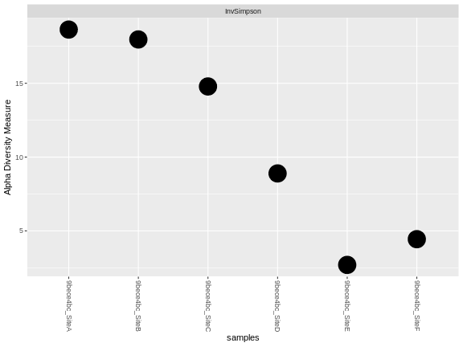

# Alpha Diversity Plot

In this example, we'll start with a single house data set. We can copy the house into a generic container
```
mydata <- myhouse
```

Start with the basic plot from Phyloseq
```
plot_richness(mydata, measures = "InvSimpson")
```


Make the point larger with `geom_point` and setting `size = 10`
```
plot_richness(mydata, measures = "InvSimpson") +
  geom_point(size = 10)
```


Next, add some color and separate some of the sites in the house with `color = "Source"`
```
plot_richness(mydata, measures = "InvSimpson",
              color = "Source") +
  geom_point(size = 10)
```


Now, fix the X axis labels with `x = "Site"`
```
plot_richness(mydata, measures = "InvSimpson",
              color = "Source",
              x = "Site") +
  geom_point(size = 10)
```


Let's continue to fix the labels with the `labs()` function
```
plot_richness(mydata, measures = "InvSimpson",
              color = "Source",
              x = "Site") +
  geom_point(size = 10) +
  labs( x = "", y = "Inv Simpson")
```


We have some extra labels at the top, strip text. We can remove that redundancy.
```
plot_richness(mydata, measures = "InvSimpson",
              color = "Source",
              x = "Site") +
  geom_point(size = 10) +
  labs( x = "", y = "Inv Simpson") +
  theme(
    strip.text.x = element_blank(),
    strip.background = element_blank(),
  )
```


The font size is still quite small. We can increase and standardize the size in the `theme`.
```
plot_richness(mydata, measures = "InvSimpson",
              color = "Source",
              x = "Site") +
  geom_point(size = 10) +
  labs( x = "", y = "Inv Simpson") +
  theme(
    strip.text.x = element_blank(),
    strip.background = element_blank(),
    axis.text = element_text(size = 12, face = "bold"),
    axis.title = element_text(size = 14,face = "bold"),
    legend.text = element_text(size = 12),
    legend.title = element_text(size = 14),
  )
```


Finally, the X axis labels are facing the wrong direction. We cna flip the angle in the `theme`.
```
plot_richness(mydata, measures = "InvSimpson",
              color = "Source",
              x = "Site") +
  geom_point(size = 10) +
  labs( x = "", y = "Inv Simpson") +
  theme(
    strip.text.x = element_blank(),
    strip.background = element_blank(),
    axis.text = element_text(size = 12, face = "bold"),
    axis.title = element_text(size = 14,face = "bold"),
    legend.text = element_text(size = 12),
    legend.title = element_text(size = 14),
    axis.text.x = element_text(angle = 90, vjust = 0.5, hjust=1)
  )
```

