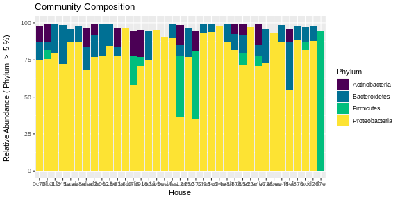

# Stacked Bar Chart, visualize community composition differences

In this example, we'll start with a single site data set. We can copy the site into a generic container, **`mydata`**.
```
mydata <- mysite
```

We will use a series of commands to combine OTU/ASVs by the taxonomic rank. 
First let's create a variable with the taxonomic rank at which you want to combine OTU/ASVs. We'll call this variable **`myTaxLevel`**. In this example, we'll be combining at the Phylum level.
```
myTaxLevel <- "Phylum"
```

You should also consider filtering out low abudance groups. We'll call this variable **`myfilter`**. In this example, we'll filter out any group that is present at less than 5% (`< 5%`).
```
myFilter <- 5
```

Now you can create a string variable with all of the information. You'll use this to label, **`myYaxis`** , for your vertical axis.
```
myYaxis <- paste("Relative Abundance (", myTaxLevel, " > ", myfilter, "%) \n")
```
Now you are ready to start reorganizing your data. The code below should work for any taxonomic level and any degree of filtering. You should be able to change the values of `myTaxLevel` and `myFilter` and then run the commands below to generate any number of different plots.


## Covert to relative abundance and combine

Start by converting the raw count data into relative abundance data as a percent (0 - 100 range). This creates a new data set called **`relmydata`**.
```
relmydata = transform_sample_counts(mydata,function(x) 100 * x / sum(x))
```
You've already set up your variables and filters so you can combine your OTU/ASVs. Your combined data will now be in the container called **`relmydata_grouped`**.
```
relmydata_grouped <- relmydata %>%
  tax_glom(taxrank = myTaxLevel) %>%        # group at your Taxonomic level
  psmelt() %>%                              # Melt to long format
  filter(Abundance > myFilter) %>%          # Filter out low abundance taxa
  arrange(myTaxLevel)                       # Sort data frame alphabetically by your Taxonomic level
```

We can clean up this data and remove unclassified OTU/ASVs labeled as `Bacteria_unclassified`. Your cleaned data will now be called **`relmydata_grouped_clean`**.
```
relmydata_grouped_clean <- subset(relmydata_grouped, relmydata_grouped[[myTaxLevel]] != "Bacteria_unclassified")
```

Next, create a color palette based on the number of groups within your taxonomic level. In this example, we'll use the Viridis palette to pull colors. The colors will be stored in a variable called **`mycolors`**.
```
mycolors <- sequential_hcl(length(unique(relmydata_grouped_clean[[myTaxLevel]])), palette = "viridis")
```

Finally, we can put this all together and use `ggplot` to graph the data.
```
ggplot(relmydata_grouped_clean, aes_string( x = "House", y = "Abundance", fill = myTaxLevel)) + 
  geom_bar(stat = "identity") +
  scale_fill_manual(values = mycolors) +
  ylab(myYaxis) +
  ggtitle("Community Composition")
```


