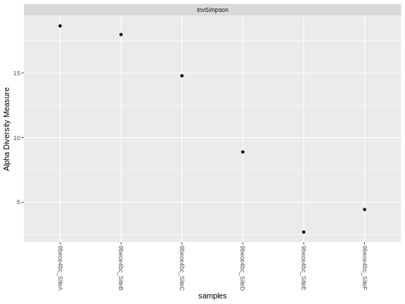
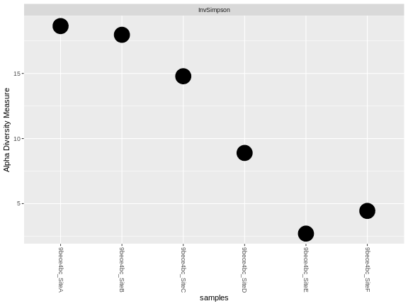

# Stacked Bar Chart, visualize community composition differences

In this example, we'll start with a single site data set. We can copy the site into a generic container
```
mydata <- mysite
```

Start by converting the raw count data into relative abundance data as a percent (0 - 100 range). This creates a new data set called `relmydata`.
```
relmydata = transform_sample_counts(mydata,function(x) 100 * x / sum(x))
```

Next, use a series of commands to combine OTU/ASVs by the taxonomic rank. 
```
myTaxLevel <- "Phylum"
```
You should also consider filtering out low abudance groups. For this example, we'll filter out any group that is present at less than 5% (`< 5%`).
```
myfilter <- 5
```

Here you'll group at
```
relmydata_phylum <- relmydata %>%
  tax_glom(taxrank = "Phylum") %>%    # group at Phylum level
  psmelt() %>%                        # Melt to long format
  filter(Abundance > myfilter) %>%    # Filter out low abundance taxa
  arrange(Phylum)                     # Sort data frame alphabetically by Phylum
```




Make the point larger with `geom_point` and setting `size = 10`
```
plot_richness(mydata, measures = "InvSimpson") +
  geom_point(size = 10)
```

