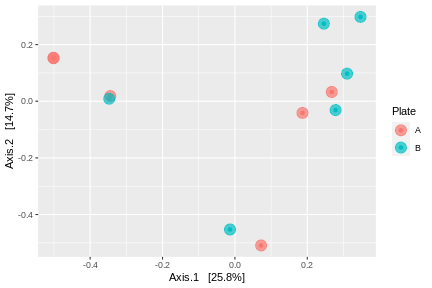

# Ordination Plots, visualize beta diversity, community composition differences

In this example, we'll start with a data set containing a mix of houses and sites. We can copy the site into a generic container, **`mydata`**.
```
mydata <- mycomplexdata
```

Visualizating ordinations takes two separate steps. First, we have to calculate the distances among all of our samples. Second, we plot those distances.

### Calculate distances
As before we calculate distances  using the `ordinate` function. In this example, we'll generate a `PCoA` graph using bray-curtis distances, `bray`.
```
mydata_ord <- ordinate(
  physeq = mydata, 
  method = "PCoA",
  distance = "bray"
)
```
### Plot distances
Next, we using the `plot_ordination` function to visualizae those distances.
```
plot_ordination(
  physeq = mydata,
  ordination = mydata_ord
) 
```
In this example, my plot looks like the one below. All of the samples are colored the same.


In most cases, we are using this kind of plot to visualize the differences among at least two different groups. We can color each of our points by membership in that group using the `color = ` parameter. In this examples, we'll color by sequencing plate (a grouping with a null expectation of differences).
```
plot_ordination(
  physeq = mydata,
  ordination = mydata_ord,
  color = "Plate"
) 
```


Everything is still quite small. If we had a lot of points, it would be quite hard to see overlapping samples. We can fix both of these by increaseing the size (`size = `) and making the points transparent (`alpha = `) within the `geom_point` function of `ggplot`. We will modify the `phyloseq` object with the additional code.
```
plot_ordination(
  physeq = mydata,
  ordination = mydata_ord,
  color = "Plate"
) +
  geom_point(aes(color = Plate),size=5, alpha = 0.7) +
  labs(color='Plate') 
```


There may be times when you want to label individual points. This can be done with the `geom_text` function of `ggplot`. In the below example, we'll label each point with the `House` and move the labels horizontally (`hjust`) and vertically (`vjust`) so they don't overlap with the point.
```
plot_ordination(
  physeq = mydata,
  ordination = mydata_ord,
  color = "Plate"
) +
  geom_point(aes(color = Plate),size=5, alpha = 0.7) +
  labs(color='Plate')  +
  geom_text(aes(label = House), size=3, hjust=1.2, vjust=1.2)
```


### Adding an elipse
To help visualize the clustering of the different groups in our plot, we might want to provide an elipse around each group. We can do this pretty simply withte `stat_ellipse` function. We will assume a multivariate distribution with the parameter `type = norm`. In the below example, we will add the elipse first, and then plot the point on top. 
```
plot_ordination(
  physeq = mydata,
  ordination = mydata_ord,
  color = "Plate"
) +
  stat_ellipse(geom="polygon",type="norm", alpha=0.1, show.legend=F, aes(fill = Plate)) +
  geom_point(aes(color = Plate),size=5, alpha = 0.7) +
  labs(color='Plate')
```


The elipse is pretty wide. Since this is just a visualize aid and we'll do some stats in a moment, let's use the `level =` parameter to shrink that elipse down.
```
plot_ordination(
  physeq = mydata,
  ordination = mydata_ord,
  color = "Plate"
) +
  stat_ellipse(geom="polygon",type="norm", level=0.75, alpha=0.1, show.legend=F, aes(fill = Plate)) +
  geom_point(aes(color = Plate),size=5, alpha = 0.7) +
  labs(color='Plate')
```


### Final clean up
We can modify this plot with a few more tweaks. If we fix the coordinate system, then the x and y axes will be on the same scale. You can change the color palette to using `ggsci` package. You’ll need to install the ggsci package and load the library before this will work. Here we use the two functions scale_color_lancet() and scale_fill_lancet() to pick colors like the journal Lancet. We're going to get rid of the gray background with `theme_minimal`. Finally, let's standardize the text size with some additional `theme` adjustments.
```
plot_ordination(
  physeq = mydata,
  ordination = mydata_ord,
  color = "Plate"
) +
  coord_fixed() +
  stat_ellipse(geom="polygon",type="norm", level=0.75, alpha=0.1, show.legend=F, aes(fill = Plate)) +
  geom_point(aes(color = Plate),size=5, alpha = 0.7) +
  labs(color='Plate') +
  scale_color_lancet() + scale_fill_lancet() +
  theme_minimal() +
  theme(
    axis.text = element_text(size = 12, face = "bold"),
    axis.title = element_text(size = 14,face = "bold"),
    legend.text = element_text(size = 12),
    legend.title = element_text(size = 14),
  )
```


### Stats
As a reminder, all of the above provides a visualization of our data, but does not compare differences between our groups in a statistical framework. Remember you can use the `adonis` test in the `vegan` package to complete this test.
```
# Calculate bray curtis distance matrix
mydata_distance <- phyloseq::distance(mydata, method = "bray")

# make a data frame from the sample_data
sampledf <- data.frame(sample_data(mydata))

# Adonis test
adonis(mydata_distance ~ Plate, data = sampledf)
```

The adonis output makes it clear that there is no reason to reject the null hypothesis, `p > 0.05`.
```
Call:
adonis(formula = mydata_distance ~ Plate, data = sampledf) 

Permutation: free
Number of permutations: 999

Terms added sequentially (first to last)

          Df SumsOfSqs MeanSqs F.Model      R2 Pr(>F)
Plate      1    0.5585 0.55846  1.3569 0.11948  0.127
Residuals 10    4.1156 0.41156         0.88052       
Total     11    4.6741                 1.00000 
```


While this particular test isn't signficant, in general, we would also run the homogeneity of dispersion test
```
beta <- betadisper(mydata_distance, sampledf$Plate)
permutest(beta)
```

In this case our output is:
```
Permutation test for homogeneity of multivariate dispersions
Permutation: free
Number of permutations: 999

Response: Distances
          Df   Sum Sq   Mean Sq      F N.Perm Pr(>F)
Groups     1 0.000002 0.0000022 0.0002    999  0.983
Residuals 10 0.142956 0.0142956
```


### Convex hulls
If you'd like to draw lines around all the points within a group, you can use `convext hulls` to accomplish this.

We have to do a little extra to get this to work. First you need to install the `ggordiplots` package from Github
```
# Only have to install packages once
install.packages("remotes")
remotes::install_github("jfq3/ggordiplots" )
# Load library
library(ggordiplots)
```

Next, you can use your existing distances stored in `mydata_ord` to run the `gg_ordiplot` function. You have to also specify the variable you'd like using the `groups = ` parameter. We'll take this new `ggplot` object alled `myord` and  
```
myord <- gg_ordiplot(mydata_ord$vectors, groups = mydata@sam_data$Plate,
                     # kind = c("ehull"),
                     ellipse  = FALSE,
                     label = FALSE,
                     hull = TRUE,
                     plot = FALSE,
) 
```
Next we plot this object with a few additional tweaks to color and text size
```
myord$plot + 
  geom_point(size=6) +
  scale_color_npg() + scale_fill_npg() +
  labs(color='Plate') +
  theme(legend.position = "bottom") + 
  theme_minimal() +
  theme(
    axis.text = element_text(size = 12, face = "bold"),
    axis.title = element_text(size = 14,face = "bold"),
    legend.text = element_text(size = 12),
    legend.title = element_text(size = 14),
  )
```

