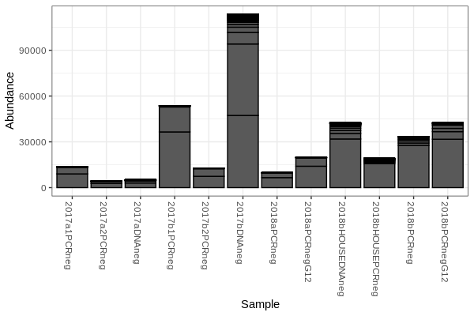
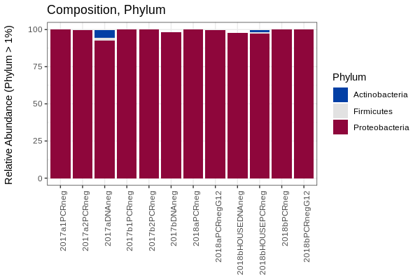

# Overview
Here we will visualize our small dataset in R.


Most of these instructions are modified from:
[Denef lab howto](http://deneflab.github.io/MicrobeMiseq/demos/mothur_2_phyloseq.html)

# Getting your workspace ready
Before you can start analyzing your data, you have to load a number of R packages

```
# Load packages -----------------------------------------------------------

library(readr)
library(ampvis2)
library(phyloseq)
library(qiime2R)
library(tidyverse)
library(ggplot2)
library(janitor)
library(forcats)
library(colorspace)
library(vegan)
library(dplyr)
library(scales)
library(grid)
library(reshape2)
library(phyloseq)
library(colorspace)
library(ape)
```

Later on, we'll be plotting our data. Here is a simple setting to give them a clean look
```
# Set plotting theme
theme_set(theme_bw())
```

# Importing your data
You've learned how to use QIIME2 to process your 16S rRNA sequencing data. We'll use the following code to import the output artifacts from QIIME. These include the feature table, a tree, the taxnomomy, and out sample metadata. By storing all of our data structures together in one object we can easily interface between each of the structures. For example, as we will see later, we can use criteria in the sample metadata to select certain samples from the ASV table

```
# Import Data from QIIME2 -------------------------------------------------
data_raw<-qza_to_phyloseq(features = "qiime/table-filtered.qza",
                                tree = "qiime/rooted_tree.qza",
                                taxonomy="qiime/taxonomy.qza",
                                metadata="metadata/demodataR.metadata.tsv"
                                )
```

The sample metadata is just a basic `.tsv` with columns for sample attributes. Here is a preview of what the sample metadata looks like.

| SampleID     | year | type |
|--------------|------|------|
| 2017a1PCRneg | 2017 | PCR  |
| 2017a2PCRneg | 2017 | PCR  |
| 2017aDNAneg  | 2017 | DNA  |

As you can see, there is one column called SampleID with the names of each of the samples. The remaining columns contain information on the sampling conditions related to each sample. The only formatting required to merge the sample data into a phyloseq object is that the rownames must match the sample names in your shared and taxonomy files.

```
# Convert Year and Type into categorical factors
data_raw@sam_data$Year <- as.factor(data_raw@sam_data$Year)
data_raw@sam_data$Type <- as.factor(data_raw@sam_data$Type)

# Create a new column with the SampleIDs
data_raw@sam_data$SampleID <- row.names(data_raw@sam_data)
```
If you type `data_raw` into the Console, you should see the following output

```
> data_raw
phyloseq-class experiment-level object
otu_table()   OTU Table:         [ 165 taxa and 12 samples ]
sample_data() Sample Data:       [ 12 samples by 3 sample variables ]
tax_table()   Taxonomy Table:    [ 165 taxa by 7 taxonomic ranks ]
phy_tree()    Phylogenetic Tree: [ 165 tips and 164 internal nodes ]
```

Now we have a phyloseq object called data_raw. 

What are the column names of our taxonomy file?

```
colnames(tax_table(data_raw))
[1] "Kingdom" "Phylum"  "Class"   "Order"   "Family"  "Genus"   "Species"
```

**Finally put your data in a new container**
```
mydata <- data_raw
```

At this point you should have a Data object called `mydata` in the **Environment** panel. This object should be a Formal *class phyloseq*.

# Basic info and plots

**Calculate the number of reads per sample**

```
sample_sums(mydata)
```

Output should look like (but contain more values):

| 2017a1PCRneg | 2017a2PCRneg | 2017aDNAneg | 2017b1PCRneg |
|--------------|--------------|-------------|--------------|
|11119          |3525         |4170         |44132         |

**Plot it**
```
plot_bar(mydata)
```
**Before you move on**, show your plot to your neighbor or the instructor. What does each bar represent? How is each bar divided? 
Does your plot look like this?



# Bar plots

Of course, you know that your samples had different numbers of reads after the QC, so you should convert your dataset to relative abundances. Use this command and create a new dataset
```
relmydata = transform_sample_counts(mydata,function(x) 100 * x / sum(x))
```
Here you’ll divide all the ASV counts by the total sample counts and then multiple by 100. Now your bars will sum to 100% and represent the relative abundance within a sample. 

You can use Phylseq's built in function to color your bar plot
```
plot_bar(relmydata,fill="Class")
```
The above command is plotting all the ASVs colored by Class. This can get pretty confusing pretty quickly. You can use the below code to pull together some of the ASVs by whatever taxonomic level you're intereseted in.

```
relmydata_phylum <- relmydata %>%
  tax_glom(taxrank = "Phylum") %>%                     # group at Phylum level
  psmelt() %>%                                         # Melt to long format
  filter(Abundance > 1) %>%                         # Filter out low abundance taxa
  arrange(Phylum)                                   # Sort data frame alphabetically by Phylum
```
Here, we are combining at the **Phylum** level and filtering out any phylum that is represented less than 1%

Next we plot the results
```
phylum_colors <- diverge_hcl(length(unique(relmydata_phylum$Phylum)))
ggplot(relmydata_phylum, aes(x = SampleID, y = Abundance, fill = Phylum)) + 
  geom_bar(stat = "identity") +
  scale_fill_manual(values = phylum_colors) +
  # Remove x axis title
  theme(axis.title.x = element_blank()) + 
  ylab("Relative Abundance (Phylum > 1%) \n") +
  theme(axis.text.x=element_text(angle=90,hjust=1)) +
  ggtitle("Composition, Phylum")
```
Does your plot look like this?


**Keep digging deeper into the data**

Now, let's look at class and family level. Below is code to combine the ASVs at each of those levels.
```
relmydata_class <- relmydata %>%
  tax_glom(taxrank = "Class") %>% 
  psmelt() %>% 
  filter(Abundance > 1) %>% 
  arrange(Class)

relmydata_family <- relmydata %>%
  tax_glom(taxrank = "Family") %>% 
  psmelt() %>% 
  filter(Abundance > 1) %>% 
  arrange(Family)            
```
Here is another exmaples to create some pretty color pallets for your categories.  There are lots more!
```
class_colors <- rainbow_hcl(length(unique(relmydata_class$Class)))
```
Finally, you can plot each level separately. First **Class**
```
ggplot(relmydata_class, aes(x = SampleID, y = Abundance, fill = Class)) + 
  geom_bar(stat = "identity") +
  scale_fill_manual(values = class_colors) +
  # Remove x axis title
  theme(axis.title.x = element_blank()) + 
  ylab("Relative Abundance (Class > 10%) \n") +
  theme(axis.text.x=element_text(angle=90,hjust=1)) +
  ggtitle("Composition, Class") 
```
and now by **Family**
In this case, we've defined the color directly in the `ggplot` command (see the `scale_fill_discrete_qualitative`). This is another alternative method.
```
ggplot(relmydata_family, aes(x = SampleID, y = Abundance, fill = Family)) + 
  geom_bar(stat = "identity") +
  scale_fill_discrete_qualitative(palette = "Dark 3") +
  # Remove x axis title
  theme(axis.title.x = element_blank()) + 
  ylab("Relative Abundance (Family > 1%) \n") +
  theme(axis.text.x=element_text(angle=90,hjust=1)) +
  ggtitle("Composition, Family")
```

**Before you move on**, show your plot to your neighbor or the instructor. What does each bar represent? How is each bar divided? 

# Ordinations
One of the best exploratory analyses for amplicon data is an ordinations to visualize the beta diversity. Phyloseq can compute these in two simple steps. You calculate the distances between all your points, then you plot that data.

Caculation
```
# Calculate
mydata_nmds_bray <- ordinate(
  physeq = mydata, 
  method = "NMDS",
  distance = "bray"
)
````
Plotting
````
# Plot
plot_ordination(
  physeq = mydata,
  ordination = mydata_nmds_bray,
  title = "NMDS of mydata (bray)",
  color = "Year",
  shape = "Type"
) + 
  geom_point(aes(color = Year), alpha = 0.7, size = 4)
```

# Alpha Diversity

Estimating alpha diversity of microbial communities is problematic no matter what you do. My best stab at it is to subsample the libraries with replacement to estimate the species abundance of the real population while standardizing sampling effort.

```
min_lib <- min(sample_sums(mydata))
```
We will subsample to 3525, the minimum number of reads. We will repeat this 100 times and average the diversity estimates from each trial.

**Initialize matrices to store richness and evenness estimates**
```
nsamp = nsamples(mydata)
trials = 100

richness <- matrix(nrow = nsamp, ncol = trials)
row.names(richness) <- sample_names(mydata)

evenness <- matrix(nrow = nsamp, ncol = trials)
row.names(evenness) <- sample_names(mydata)
```

**It is always important to set a seed when you subsample so your result is replicable**
```
set.seed(3)
```
The create a loop to do all the subsampling
```
for (i in 1:100) {
  # Subsample
  r <- rarefy_even_depth(mydata, sample.size = min_lib, verbose = FALSE, replace = TRUE)
  
  # Calculate richness
  rich <- as.numeric(as.matrix(estimate_richness(r, measures = "Observed")))
  richness[ ,i] <- rich
  
  # Calculate evenness
  even <- as.numeric(as.matrix(estimate_richness(r, measures = "InvSimpson")))
  evenness[ ,i] <- even
}
```

Let’s calculate the mean and standard deviation per sample for observed richness and inverse simpson’s index and store those values in a dataframe.
```
# Create a new dataframe to hold the means and standard deviations of richness estimates
SampleID <- row.names(richness)
mean <- apply(richness, 1, mean)
sd <- apply(richness, 1, sd)
measure <- rep("Richness", nsamp)
rich_stats <- data.frame(SampleID, mean, sd, measure)

# Create a new dataframe to hold the means and standard deviations of evenness estimates
SampleID <- row.names(evenness)
mean <- apply(evenness, 1, mean)
sd <- apply(evenness, 1, sd)
measure <- rep("Inverse Simpson", nsamp)
even_stats <- data.frame(SampleID, mean, sd, measure)
```

**Now we will combine our estimates for richness and evenness into one dataframe**
```
alpha <- rbind(rich_stats, even_stats)
```

Let’s add the sample metadata into this dataframe using the `merge()` command
```
s <- data.frame(sample_data(mydata))
alphadiv <- merge(alpha, s, by = "SampleID") 
```

**Finally, we will plot the two alpha diversity measures using a facet**

```
ggplot(alphadiv, aes(x = SampleID, y = mean)) +
  geom_errorbar(aes(ymin=mean-sd, ymax=mean+sd), colour="black", width=.1) +
  geom_point(size = 2) +
  facet_wrap(~measure, ncol = 1, scales = "free")
```
*Phyloseq can also do the hard work for you with a one line code*
```
plot_richness(mydata, measures = "InvSimpson")
```
There are many metrics built into Phyloseq
```
# Shannon Diveristy
plot_richness(mydata,measures = "Shannon")
```
