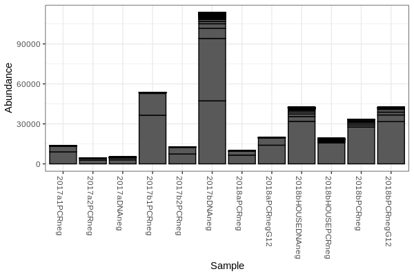
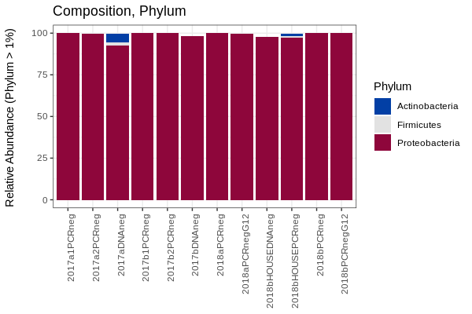

# Overview
These instructions guide you through the analysis and visualization of microbiome data
using the phyloseq package in R. We will import data from QIIME2,
create plots for taxonomic composition, and calculate alpha and beta diversity.

Most of these instructions are modified from:
[Denef lab howto](http://deneflab.github.io/MicrobeMiseq/demos/mothur_2_phyloseq.html)

# Section 1: Getting your workspace ready
We begin by loading all the necessary R packages. Each package has a specific role:
* `phyloseq`: The core package for importing, storing, and analyzing microbiome data.
* `qiime2R`: Helps import data from QIIME2 formats (.qza files).
* `tidyverse` & `ggplot2`: Powerful tools for data manipulation and creating beautiful plots.
* `vegan`: A popular package for ecological analyses, including diversity calculations.
* Other packages provide additional functions for plotting and data handling.

```
# Load packages -----------------------------------------------------------

library(readr)
library(ampvis2)
library(phyloseq)
library(qiime2R)
library(tidyverse)
library(ggplot2)
library(janitor)
library(forcats)
library(colorspace)
library(vegan)
library(dplyr)
library(scales)
library(grid)
library(reshape2)
library(phyloseq)
library(colorspace)
library(ape)
```

Later on, we'll be plotting our data. Set a consistent plotting theme for all our graphs.
`theme_bw()` gives a clean black-and-white background.
```
# Set plotting theme
theme_set(theme_bw())
```

# Section 2: Importing your data
You've learned how to use QIIME2 to process your 16S rRNA sequencing data. We'll use the following code to import the output artifacts from QIIME. These include the feature table, a tree, the taxnomomy, and out sample metadata. By storing all of our data structures together in one object we can easily interface between each of the structures. For example, as we will see later, we can use criteria in the sample metadata to select certain samples from the ASV table

```
# Import Data from QIIME2 -------------------------------------------------
data_raw<-qza_to_phyloseq(features = "qiime/table-filtered.qza",
                                tree = "qiime/rooted_tree.qza",
                                taxonomy="qiime/taxonomy.qza",
                                metadata="metadata/demodataR.metadata.tsv"
                                )
```

The sample metadata is just a basic `.tsv` with columns for sample attributes. Here is a preview of what the sample metadata looks like.

| Sample Data  | Year | Type |
|--------------|------|------|
| 2017a1PCRneg | 2017 | PCR  |
| 2017a2PCRneg | 2017 | PCR  |
| 2017aDNAneg  | 2017 | DNA  |

**It's good practice to ensure metadata columns are in the correct format.** As you can see, there is one column with the names of each of the samples. The remaining columns contain information on the sampling conditions related to each sample. The only formatting required to merge the sample data into a phyloseq object is that the rownames must match the sample names in your shared and taxonomy files.

We convert 'Year' and 'Type' into factors, which are R's way of representing categorical data. We also create a new column 'SampleID' in the metadata from the row names for easier plotting later.

```
# Convert Year and Type into categorical factors
data_raw@sam_data$Year <- as.factor(data_raw@sam_data$Year)
data_raw@sam_data$Type <- as.factor(data_raw@sam_data$Type)

# Create a new column with the SampleIDs
data_raw@sam_data$SampleID <- row.names(data_raw@sam_data)
```
If you type `data_raw` into the Console, you should see the following output

```
> data_raw
phyloseq-class experiment-level object
otu_table()   OTU Table:         [ 165 taxa and 12 samples ]
sample_data() Sample Data:       [ 12 samples by 3 sample variables ]
tax_table()   Taxonomy Table:    [ 165 taxa by 7 taxonomic ranks ]
phy_tree()    Phylogenetic Tree: [ 165 tips and 164 internal nodes ]
```

Now we have a phyloseq object called data_raw. 

What are the column names of our taxonomy file? This will be helpful later.

```
colnames(tax_table(data_raw))
[1] "Kingdom" "Phylum"  "Class"   "Order"   "Family"  "Genus"   "Species"
```

**Finally put your data in a new container**
```
mydata <- data_raw
```

At this point you should have a Data object called `mydata` in the **Environment** panel. This object should be a Formal *class phyloseq*.

# Section 3: Taxonomic Composition Plots

**Calculate the number of reads per sample**

```
sample_sums(mydata)
```

Output should look like (but contain more values):

| 2017a1PCRneg | 2017a2PCRneg | 2017aDNAneg | 2017b1PCRneg |
|--------------|--------------|-------------|--------------|
|11119          |3525         |4170         |44132         |

Now, try to **Plot it**
```
plot_bar(mydata)
```
**Before you move on**, show your plot to your neighbor or the instructor. What does each bar represent? How is each bar divided? 
Does your plot look like this?



# Bar plots

Of course, you know that your samples had different numbers of reads after the QC, so you should convert your dataset to relative abundances. Use this command and create a new dataset
```
relmydata = transform_sample_counts(mydata,function(x) 100 * x / sum(x))
```
Here you’ll divide all the ASV counts by the total sample counts and then multiple by 100. Now your bars will sum to 100% and represent the relative abundance within a sample. 

You can use Phylseq's built in function, `plot_bar()`, to color your bar plot
```
plot_bar(relmydata,fill="Class")
```
The above command is plotting all the ASVs colored by Class. This can get pretty confusing pretty quickly. You can use the below code to pull together some of the ASVs by whatever taxonomic level you're intereseted in.

```
relmydata_phylum <- relmydata %>%
  tax_glom(taxrank = "Phylum") %>%  # 1. Group taxa by their Phylum.
  psmelt() %>%                      # 2. Convert the into a 'long' data frame suitable for ggplot.
  filter(Abundance > 1) %>%         # 3. Keep phyla that make up >1% of the abundance.
  arrange(Phylum)                   # 4. Sort the data frame by Phylum name.
```
Here, we are combining at the **Phylum** level and filtering out any phylum that is represented less than 1%

Next we plot the results
```
# Create a color palette for the phyla.
phylum_colors <- diverge_hcl(length(unique(relmydata_phylum$Phylum)))
# Create the ggplot bar chart.
ggplot(relmydata_phylum, aes(x = SampleID, y = Abundance, fill = Phylum)) + 
  geom_bar(stat = "identity") + # Creates the stacked bars
  scale_fill_manual(values = phylum_colors) + # Applies our custom colors
  theme(axis.title.x = element_blank()) + # Removes the x-axis title
  ylab("Relative Abundance (Phylum > 1%) \n") + # Sets the y-axis label
  theme(axis.text.x=element_text(angle=90,hjust=1)) + # Rotates sample names for readability
  ggtitle("Composition, Phylum") # Adds a title
```
Does your plot look like this?


**Keep digging deeper into the data**

Now, let's look at **Class** and **Family** levels. Below is code to combine the ASVs at each of those levels.
```
# -- Class Level Merge --
relmydata_class <- relmydata %>%
  tax_glom(taxrank = "Class") %>% 
  psmelt() %>% 
  filter(Abundance > 1) %>% 
  arrange(Class)

# -- Family Level Merge --
relmydata_family <- relmydata %>%
  tax_glom(taxrank = "Family") %>% 
  psmelt() %>% 
  filter(Abundance > 1) %>% 
  arrange(Family)            
```

Finally, you can plot each level separately. 

**Class**: For this example, we'll modify the code to use a different color pallet for your categories.  There are lots more!
```
# Create the Class-level ggplot.
class_colors <- rainbow_hcl(length(unique(relmydata_class$Class)))
ggplot(relmydata_class, aes(x = SampleID, y = Abundance, fill = Class)) + 
  geom_bar(stat = "identity") +
  scale_fill_manual(values = class_colors) +
  # Remove x axis title
  theme(axis.title.x = element_blank()) + 
  ylab("Relative Abundance (Class > 10%) \n") +
  theme(axis.text.x=element_text(angle=90,hjust=1)) +
  ggtitle("Composition, Class") 
```
**Family**: In this case, we've defined the color directly in the `ggplot` command (see the `scale_fill_discrete_qualitative`). This is another alternative method.
```
# Create the Family-level ggplot.
ggplot(relmydata_family, aes(x = SampleID, y = Abundance, fill = Family)) + 
  geom_bar(stat = "identity") +
  scale_fill_discrete_qualitative(palette = "Dark 3") +
  # Remove x axis title
  theme(axis.title.x = element_blank()) + 
  ylab("Relative Abundance (Family > 1%) \n") +
  theme(axis.text.x=element_text(angle=90,hjust=1)) +
  ggtitle("Composition, Family")
```

**Before you move on**, show your plot to your neighbor or the instructor. What does each bar represent? How is each bar divided? 

# Section 4: Beta Diversity
One of the best exploratory analyses for amplicon data is an ordinations to visualize the beta diversity. Beta diversity measures how different the microbial communities are between samples. We'll use Non-Metric Multidimensional Scaling (NMDS) with Bray-Curtis dissimilarity. Phyloseq can compute these in two simple steps. You calculate the distances between all your points, then you plot that data.

**Calculate the ordination**. `ordinate()` is a phyloseq function that performs the complex calculations. Bray-Curtis is a common distance metric based on abundance.
```
# Calculate the ordination.
mydata_nmds_bray <- ordinate(
  physeq = mydata, 
  method = "NMDS",
  distance = "bray"
)

````
**Plot the ordination**. Each point represents the entire microbial community of a single sample. Points that are closer together have more similar communities. Here we are coloring the points by the `Year` column in our metadata. We use shape to represent the `Type` column

```
# Plot the ordination.
plot_ordination(
  physeq = mydata,
  ordination = mydata_nmds_bray,
  title = "NMDS of mydata (bray)",
  color = "Year",
  shape = "Type"
) + 
  geom_point(aes(color = Year), alpha = 0.7, size = 4)
```

# Section 5: Alpha Diversity

Estimating alpha diversity of microbial communities is problematic no matter what you do. To account for uneven sequencing depth, we first need to 'rarefy' our data, which means subsampling all samples to the same number of reads. My best stab at it is to subsample the libraries with replacement to estimate the species abundance of the real population while standardizing sampling effort.

Find the lowest sequencing depth in our dataset. This will be our rarefaction depth.
```
min_lib <- min(sample_sums(mydata))
```
We will subsample to 3525, the minimum number of reads. Since rarefaction involves random subsampling, we will repeat it 100 times and calculate the average diversity to get a more stable estimate.

**Initialize matrices to store richness and evenness estimates**
```
nsamp = nsamples(mydata)
trials = 100

# Create empty matrices to store the results of each trial.
richness <- matrix(nrow = nsamp, ncol = trials)
row.names(richness) <- sample_names(mydata)

evenness <- matrix(nrow = nsamp, ncol = trials)
row.names(evenness) <- sample_names(mydata)
```

**Setting a seed ensures that the random subsampling is reproducible.**
```
set.seed(3)
```
Start the loop to perform rarefaction 100 times.
```
for (i in 1:100) {
  # 1. Subsample the data to the minimum library size.
  r <- rarefy_even_depth(mydata, sample.size = min_lib, verbose = FALSE, replace = TRUE)
  
  # 2. Calculate richness (number of observed species/ASVs).
  rich <- as.numeric(as.matrix(estimate_richness(r, measures = "Observed")))
  richness[ ,i] <- rich
  
  # 3. Calculate evenness (here using the Inverse Simpson index).
  even <- as.numeric(as.matrix(estimate_richness(r, measures = "InvSimpson")))
  evenness[ ,i] <- even
}
```

Now, summarize the results from the 100 trials. Let’s calculate the mean and standard deviation per sample for observed richness and inverse simpson’s index and store those values in a dataframe.
```
# Create a new dataframe for the richness results (mean and standard deviation).
SampleID <- row.names(richness)
mean <- apply(richness, 1, mean)
sd <- apply(richness, 1, sd)
measure <- rep("Richness", nsamp)
rich_stats <- data.frame(SampleID, mean, sd, measure)

# Create a new dataframe for the evenness results.
SampleID <- row.names(evenness)
mean <- apply(evenness, 1, mean)
sd <- apply(evenness, 1, sd)
measure <- rep("Inverse Simpson", nsamp)
even_stats <- data.frame(SampleID, mean, sd, measure)
```

**Now we will combine our estimates for richness and evenness into one dataframe**
```
alpha <- rbind(rich_stats, even_stats)
```

Let’s add the sample metadata into this dataframe using the `merge()` command
```
s <- data.frame(sample_data(mydata))
alphadiv <- merge(alpha, s, by = "SampleID") 
```

**Plot the alpha diversity results with error bars representing the standard deviation.**

```
ggplot(alphadiv, aes(x = SampleID, y = mean)) +
  geom_errorbar(aes(ymin=mean-sd, ymax=mean+sd), colour="black", width=.1) +
  geom_point(size = 2) +
  facet_wrap(~measure, ncol = 1, scales = "free") + # Create separate panels for each metric
  theme(axis.text.x=element_text(angle=90,hjust=1,vjust=0.5)) # Rotate sample labels
```
*Phyloseq also has a built-in function for a quick alpha diversity plot.* This is useful for a quick look but offers less customization.
```
plot_richness(mydata, measures = "InvSimpson")
```
There are many metrics built into Phyloseq. You can find more with the command `help("plot_richness")` and then looking at `measures`. For instance, below you can plot the Shannon Diversity.
```
# Shannon Diveristy
plot_richness(mydata,measures = "Shannon")
```
